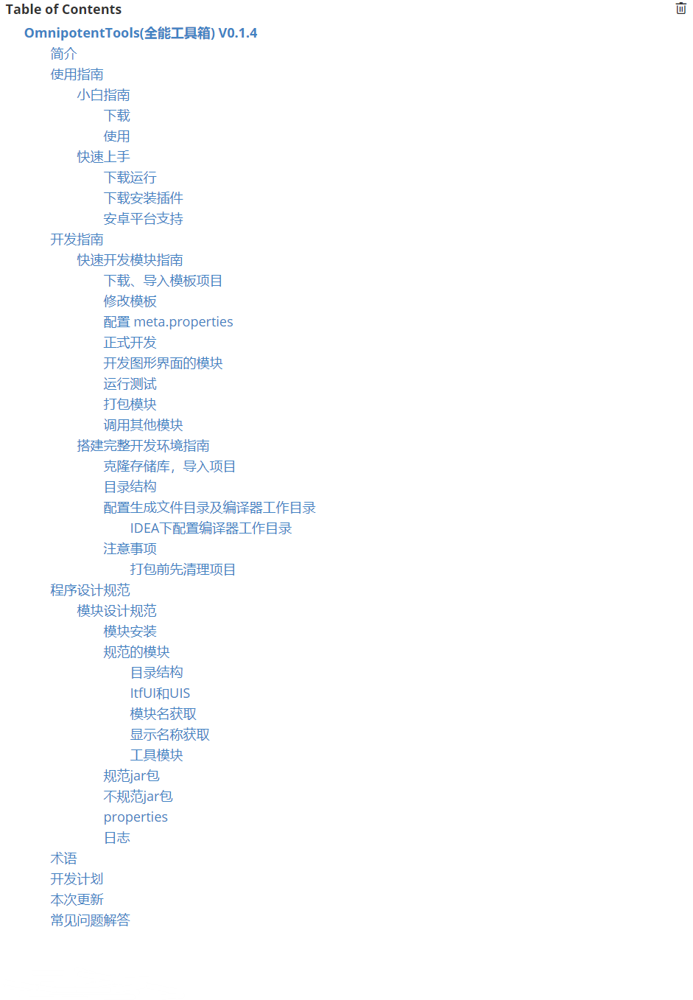

# OmnipotentTools(全能工具箱) V0.1.4


[toc]

## 简介

**OmnipotentTools**是一款**强大的模块化工具箱**，跨平台，支持**简单快速开发模块**，模块**即插即用**，同时可以安装jar程序，创新的提出了模块**相互调用**架构。

本软件的**终极目标**是打造**全平台**，**全功能**的全能软件，仅需查看其他模块的接口并且调用就可以为自己**快速开发自己需要的功能模块**，未来本软件将支持更多平台。

目前工具箱仅有控制台页面，但是**模块开发**已经**支持图形界面**，所以大家可以开始开发具有图形界面的模块了。

## 使用指南

### 小白指南

#### 下载

访问 https://github.com/yhhit/OmnipotentTools/releases 点击 OmnipotentTools_with_jdk.zip 开始下载。

#### 使用

解压 OmnipotentTools_with_jdk.zip  打开文件夹，双击 "看不懂的话点我运行.cmd"

### 快速上手

#### 下载运行

访问 https://github.com/yhhit/OmnipotentTools/releases 点击 OmnipotentTools.zip 或 OmnipotentTools_with_jdk.zip 开始下载。

解压 OmnipotentTools_with_jdk.zip  打开文件夹，双击 "runConsoleUI.cmd"运行。

#### 下载安装插件

访问 https://github.com/yhhit/OmnipotentTools/releases 下载 xxx.jar。

打开OmnipotentTools 在菜单中输入 i 按回车 拖入jar包进行安装。

#### 安卓平台支持

首先下载解压OmnipotentTools到你的安卓手机。

在release下载 Jvdroid 并安装。

点击左上角菜单按钮，点击Terminal。

输入 cd path 按回车 

**path是解压 OmnipotentTools 路径**

确保当前路径已经在 OmnipotentTools的根目录下

输入 ./runConsoleUI.sh 即可启动。

## 开发指南

### 快速开发模块指南

#### 下载、导入模板项目

在github上克隆存储库到你的电脑。打开Modules下的ModuleTemplate项目。

配置Maven(如不使用Maven也可不用配置)

配置jdk版本为11

#### 修改模板

展开 xyz.yhhit.OmnipotentTools.Modules 包

修改 ModuleName 包名为 要开发的模块名

修改pom文件 artifactId 为模块名

```java
<artifactId>ModuleTemplate</artifactId>
```

修改 ItfUI.java 下的

```java
final static String LocalName="模块名";
```

#### 配置 meta.properties

~~~java
Version=x.x.x
#declare what modes this mode need
#example: DependencyModules = ModeName1 ModeName2 ModeName3 ...
DependencyModules =
~~~

#### 正式开发

模块的功能都在ConsoleUI类中实现，ConsoleUI继承自ItfUI接口

```java
public class ConsoleUI implements ItfUI
```

ItfUI接口非常简单，需要注意的函数onCreate()、onShowUI()、onExit()三个函数;

分别在木块被创建、展示、退出时被调用、用于初始化、展示界面和清理工作。

模板中onShowUI中的代码是一个示例代码，可以完全删除，您可以根据喜好修改。

开发时需要将可供其他函数调用的功能卸载ItfUI接口中，这样其他模块便可以通过此接口调用你的模块的功能。

```java
 final static String LocalName="模块名";
    public enum UI_TYPE{
        CONSOLE_UI,GRAPHIC_UI
    }
    //此函数内应包含模块运行必须提前进行的操作（如没有函数体可为空），当其他模块调用此模块其他函数时，会先运行此函数
    public int onCreate();
    //调用此函数加载模块UI界面
    public int onShowUI(String[] args);
    //当模块退出时会调用此函数
    public int onExit();
    //用于获取软件的本地化名称
    public default String getLocalName(){return LocalName;};
    //用于获取软件版本号
    public default String getVersion(){
        return getModuleVersion();
    }
    //用于获取界面是图形界面还是控制台界面
    public UI_TYPE getUIType();

    //请将可供其他模块的调用的函数放在此处，建议使用public default returnValue funName(){}声明(也可不用default)，尽量不要声明为静态方法
    //注意：函数参数不可使用基本类型如int等，应当使用相应的包装器。
```

#### 开发图形界面的模块

在UIS下新建类 GraphicUI 复制ConsoleUI的所有函数到 GraphicUI中即可

#### 运行测试

运行ConsoleUI类即可(图形界面运行GraphicUI类)

#### 打包模块

将模块直接打包为jar包即可

#### 调用其他模块

~~~java
@Override
public int onCreate() {
    //注册模块名和调用UI名
    HashMap<String,String> depHash=new HashMap<>();
    depHash.put("BartendingCalculator","ConsoleUI");
    registerDependency(depHash);
    return 0;
}

@Override
public int onShowUI(String[] args) {
    //调用函数
    //新建参数数组
    Object[] args={parameter1,parameter1};
    try {
        ReturnType returnValue = (ReturnType) callOtherModuleFunction( "BartendingCalculator" ,"calcAmountOfBaseWine",args);
    } catch (Exception e) {
        e.printStackTrace();
    }
}
~~~

以下是调用 BartendingCalculator 下 calcAmountOfBaseWine 函数的示例，这是一个比较复杂的示例，如果无法理解并无关系。

这是方法的原型：

~~~java
 // Calculate the amount of base wine added
    public default void calcAmountOfBaseWine(Double basicLiquorsContent, Double cocktailAlcoholContent,
                                             Double[] mixersMass, Double basicLiquorsMass[]){
        basicLiquorsMass[0]=(cocktailAlcoholContent*mixersMass[0])/(basicLiquorsContent-cocktailAlcoholContent);
    }
~~~

这是完整的调用示例：

~~~java
//注册模块名和调用UI名
HashMap<String,String> depHash=new HashMap<>();
depHash.put("BartendingCalculator","ConsoleUI");
registerDependency(depHash);

Double[] answer=new Double[1];
Object[] args={40.0,5.0,new Double[]{100.0},answer};
try {
    callOtherModuleFunction( "BartendingCalculator" ,"calcAmountOfBaseWine",args);
} catch (Exception e) {
    e.printStackTrace();
}
System.out.println("answer is:"+answer[0]);
~~~


### 搭建完整开发环境指南

以上的模块开发并不包含ImnipotentTools主程序，无法集成测试。如需搭建完整开发环境请参见以下教程。

#### 克隆存储库，导入项目

在github上克隆存储库到你的电脑。导入开发软件中打开。

#### 目录结构

Modules目录用于存放模块代码，ToolBox是主程序代码

#### 配置生成文件目录及编译器工作目录

主程序的生成目录已经在pom文件中配置为项目根目录下的target/classes目录，以下是参考代码

模块模板的生成目录请自行配置到和主程序生成目录一致

```
<outputDirectory>../target/classes</outputDirectory>
<testOutputDirectory>../target/test-classes</testOutputDirectory>
```

接下来需要配置编译器工作目录到项目根目录下的target/classes目录中。

##### IDEA下配置编译器工作目录

点击右上角运行按钮左边的运行配置框，点击 Edit Configurations 修改 working directory 与上面的编译生成目录一致。

#### 注意事项

##### 打包前先清理项目

在使用完整开发环境开发时，编译的主程序文件和模块文件会混合在一起，如果直接打包会打包所有文件，所以应该先清理整个项目在打包模块。

## 程序设计规范

### 模块设计规范

可安装模块分为三种：规范模块、规范jar包、不规范jar包。规范的所有可安装模块安装后都位于 xyz/yhhit/OmnipotentTools/Modules/ 目录下。不规范jar包安装后位于 xyz/yhhit/OmnipotentTools/ExtModules/ 目录下。

#### 模块安装

安装模块时如果模块已经存在应该提示覆盖安装的问题，如果安装版本高于目标版本则不必提示，如果低于目标版本则拒绝安装，提示卸载后才可以安装。

#### 规范的模块

规范模块安装时会解压覆盖到主程序根目录。

##### 目录结构

规范模块必须位于 .../Modules/模块名/ 下。该目录下包含模块的所有文件以及meta.properties配置文件(**必须包含**)，规范模块的 meta.properties 文件应包含以下内容。meta.properties的详细内容在后面一点的位置介绍。

~~~properties
DependencyModules
Version
~~~

##### ItfUI和UIS

规范模块的 UIS 文件夹下可以包含任意界面文件,主程序会扫描所有可用的UI。有两个特殊UI已经被定义。分别是 ConsoleUI.java 和 GraphicUI.java 分别表示控制台界面UI和图形界面UI。所有UI都应继承于该模块的 ItfUI.java 接口。 ItfUI.java 接口中应该定义可供其他模块调用的公有函数，并且最好将实现计算等所有界面通用的函数设置为 default 方法。虽然这里我们将 ItfUI.java 的实现类称为UI界面。其他模块调用该模块时实际上是通过 ItfUI 的实现类来调用函数的，所以UIS下的类不仅提供界面显示，还应提供其他模块调用的具体方法的实现。

可供其他程序调用的函数定义时参数不可使用基本类型，应该使用基本类型的包装器。如int应使用Interger，这样其他模块通过callExtFunction()函数就可以直接调用。如果使用了基本类型，其他模块调用时就只能自己通过反射调用。

##### 模块名获取

主程序获取规范模块的模块名的方式有些不同，是通过 .../Modules/ 目录下的文件夹名来判断模块名的。

##### 显示名称获取

主程序获取规范模块显示名称的方式有些不同，首先会通过查找 meta.properties 下是否存在 ShowName 属性，如果存在则显示 ShowName 的属性值。否则调用模块随机一个UI的 getModuleLocalName 函数获取模块本地化的显示名称。如果获取失败，则会返回模块 Name。

##### 工具模块

没有 UI 的模块被称为工具模块，用来提供函数调用给其他模块。

#### 规范jar包

规范jar包安装时会复制到 .../Modules/模块名/ 下。

该目录下包含jar文件，jar文件应当可运行并且jar内部根目录下**必须包含** meta.properties 配置文件，规范jar包的 meta.properties 文件应包含以下内容。

通过配置UIType可以以ConsoleUI 、GraphicUI两种方式运行。

~~~properties
Name
Version
ShowName
#目前这个属性没有作用，所有程序都由GraphicUi方式调用
UIType
DependencyModules
~~~

#### 不规范jar包

不规范jar包安装时会复制到 .../ExtModules/ 下，以"UUID"创建文件夹放置jar文件。

该目录下包含jar文件和 meta.properties 配置文件，注意这与已注册jar包不同，该 meta.properties 安装时自动生成，应包含以下内容。

运行时以UIType=ConsoleUI方式运行

~~~properties
ShowName
~~~

#### properties

以下是properties所有可能属性的解释

~~~properties
#模块名
Name = Xxx
#版本号
Version = x.x.x
#模块默认显示名（由用户设置）
ShowName = Show name
#模块的启动方式（1.ConsoleUI 2.GraphicUI）
#目前这个属性没有作用，所有程序都由GraphicUi方式调用
UIType = ConsoleUI
#依赖的模块
DependencyModules =  ModeName1 ModeName2 ModeName3 ...
#以下属性还未支持
#仅可运行平台
OnlyRunnablePlatform
#不可运行平台
NotRunnablePlatform
~~~

#### 日志

## 术语

模块:可供主程序下载、安装、运行的程序，类似与插件，但是模块之间可以互相调用。

## 开发计划

* 近期计划
  * 下载模块
* 总计划
* 添加多国语言功能。
* 添加网络模块功能。
* 解决版本兼容性问题。
* 添加版本号比较工具。
* 添加图形界面。

## 本次更新

* 安装模块
* 卸载模块
* 清理依赖
* 架构升级

## 常见问题解答

本软件如何解决依赖问题？

为了解决模块依赖问题，安装模块文件将直接覆盖模块文件到根目录下，并提供清理所有依赖功能，清理所有依赖后必须重新安装使用依赖的模块.